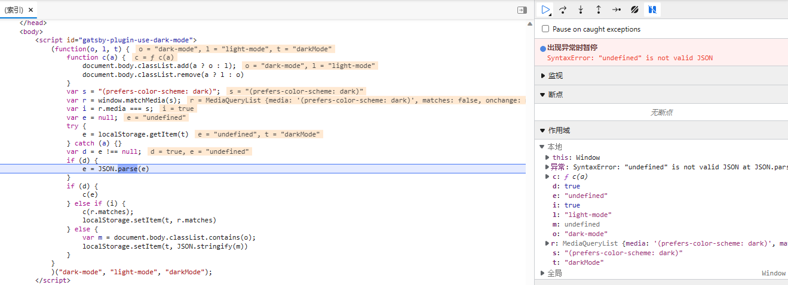
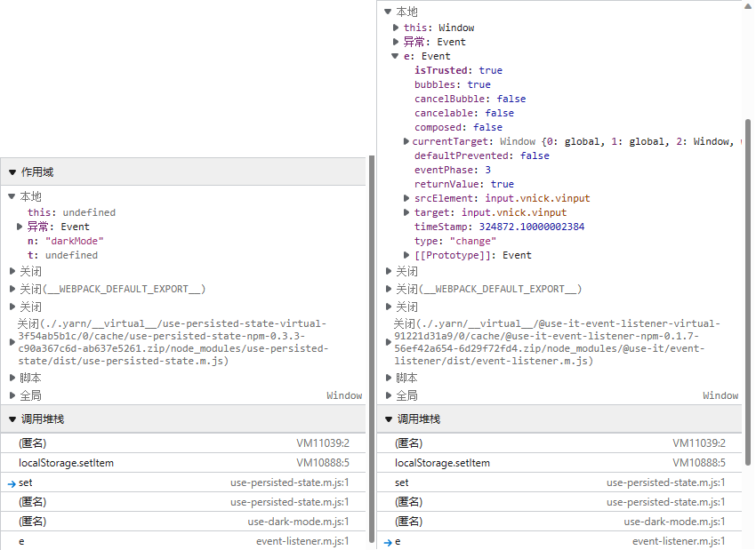

被害人供词：我先晚睇到有人喺我嘅文章底部留言，我就回覆佢，點知天早我嘅 website 就打唔開咗 😭

嫌疑人 Valine：阿 Sir，唔係我做嘅，我只不过係一个评论区组件，冇咁大本事㖞

## 直接原因

好，那么到底是怎么回事呢？先来看看浏览器给的造成网站崩溃的直接原因：



这又牵扯到了本次案件的另一个主角：__use-dark-mode__

use-dark-mode 是一个为站点提供夜间模式的 React 组件，夜间模式的值会以 __darkMode__ 为名保存在本地储存中以保证下次访问时站点是上次的模式；而 __gatsby-plugin-use-dark-mode__ 则是用来给站点插入 JS 脚本防止产生闪光的。造成网站崩溃的原因正是因为脚本在读取本地储存的 __darkMode__ 时读到了个 `undefined`，所以大家在用 __JSON.parse__ 时一定要放在 `try{}` 里面用啊。

但是问题又来了，在正常情况下 __darkMode__ 应该是 `true` 或者 `false`，为什么会变成 `undefined` 呢？这个问题不得到解决的话，夜间模式的值就无法在每次访问时记录下来了（如果评论了的话），所以只好继续追本溯源下去。

## 幕后推手

先梳理一下目前的事件脉络：

-   进行评论
-   ???
-   重新加载网页
-   夜间模式插件读取到 `undefined` 并直接调用 `JSON.parse` 导致网站崩溃

问号部分究竟发生了什么？于是我又把目光看向了评论区组件：打开开发者模式的应用部分可以看到所有保存在网站的数据，随着评论操作的一步步进行 darkMode 的值果然发生了变化（也不用“一步步进行”，第一步就抓到了）

<video controls loop>
    <source src="/videos/test.mp4" type="video/mp4" />
</video>

一看到这我感觉 Valine 的嫌疑很大，因为 Valine 也会使用本地储存以保存用户输入的昵称、邮箱等。但我在 Valine 的源码中遨游了半个下午也没找到证据，我决定不管了！直接去提 issue！正当我编写复现步骤时，我发现我无法在 Valine 的官网上复现，因为其官网没有夜间模式，所以我先在控制台执行 `localStorage.setItem('darkMode', 'false')` 以模仿夜间模式组件保存 __darkMode__ 值，随后无论我对评论区怎么操作 __darkMode__ 都还是那个 `false`。至此我想 Valine 大抵是清白的了，可我还是没想通为什么在我的网站上会出问题。

## 柳暗花明

厕所是人类灵感的源泉，于是在厕所思考了一会后……我有了新的想法！我先把开发者模式的“异常时暂停”选项打开，然后在控制台依次执行：

```js
// 1、暂存原始的 setItem 方法
const orignalSetItem = localStorage.setItem;
// 2、重写 setItem，让其调用时发送一个事件
localStorage.setItem = function (key, newValue) {
    let setItemEvent = new Event('setItemEvent');
    setItemEvent.newValue = newValue;
    setItemEvent.key = key;
    window.dispatchEvent(setItemEvent);
    orignalSetItem.apply(this, arguments);
};
// 3、捕获这个事件并直接抛出异常
window.addEventListener('setItemEvent', function (e) {
    throw e;
});
```

这样 __setItem__ 就能像断点一样，一旦被调用就会把线程暂停，我也就能好好看看是什么妖魔鬼怪在作祟（为什么没能早点想到这个办法 😭）。再次评论我得到了下面的结果：



居然是 use-dark-mode 自己把 `undefined` 写进去了，看到这里我既兴奋又无语 🤣 那么既然都找到这了，就探索下源码，看看他为什么会想不开自己把自己搞崩吧。

## 水落石出

根据浏览器的指引，我找到了“罪魁祸首”，这里只放核心代码，完成的源码可在 [use-dark-mode 的仓库](https://github.com/donavon/use-dark-mode/) 里找到。

```js
// src/initialize.js
import {useState} from 'react';
import createPersistedState from 'use-persisted-state';

const preferDarkQuery = '(prefers-color-scheme: dark)';

const initialize = (storageKey, storageProvider, glbl = global) => {
    const usePersistedDarkModeState = storageKey
        ? createPersistedState(storageKey, storageProvider)
        : useState;

    const mql = glbl.matchMedia ? glbl.matchMedia(preferDarkQuery) : {};

    const mediaQueryEventTarget = {
        addEventListener: (_, handler) =>
            mql.addListener && mql.addListener(handler),
        removeEventListener: (_, handler) =>
            mql.removeListener && mql.removeListener(handler),
    };

    // ...
    return {
        usePersistedDarkModeState,
        getDefaultOnChange,
        mediaQueryEventTarget,
        getInitialValue,
    };
};

export default initialize;
```

```js
// src/index.js
import { useEffect, useCallback, useMemo } from 'react';
import useEventListener from '@use-it/event-listener';

import initialize from './initialize';

const useDarkMode = (
  // ...
) => {
  const {
    usePersistedDarkModeState,
    getDefaultOnChange,
    getInitialValue,
    mediaQueryEventTarget,
  } = useMemo(
    () => initialize(storageKey, storageProvider, global),
    [storageKey, storageProvider, global]
  );

  const [state, setState] = usePersistedDarkModeState(getInitialValue(initialValue));

  // ...

  // Listen for media changes and set state.
  useEventListener(
    'change',
    ({ matches }) => setState(matches),
    mediaQueryEventTarget
  );

  return {
    value: state,
    enable: useCallback(() => setState(true), [setState]),
    disable: useCallback(() => setState(false), [setState]),
    toggle: useCallback(() => setState(current => !current), [setState]),
  };
};

export default useDarkMode;
```

可以看到，use-dark-mode 为了让夜间模式的值随系统改变而改变进行了以下操作：

1. 使用 __matchMedia__ API 获取了媒体 `(prefers-color-scheme: dark)` 的 __MediaQueryList__ 对象
2. 调用了 __useEventListener__ 监听该对象的 __change__ 事件
3. 该事件触发时将 __matches__ 的值交由 __use-persisted-state__ 来赋值给本地储存中的 __darkMode__

但是从之前的截图中可以看到，造成异常的这个事件的 __target__ 为 `input.vnick.vinput`。也就说 __useEventListener__ 将监听器绑定在了评论区的输入框上，因此一旦输入框的内容改变就会发起 __change__ 事件，而 __matches__ 的值在此时就变成了 `undefined` 最终写到了 __darkMode__ 中。为什么监听器会绑定到评论区的输入框上呢？我看了下 Valine 的 CSS 样式，确实含有 `@media(prefers-color-scheme: dark)`，但这是让组件自适应系统配色而很常用的样式，正常来说不会将媒体的监听器绑定到组件上来，我想这应该是 use-dark-mode 在服务端渲染时的一个 bug，因为我在切换系统配色时网站颜色并不会跟着切换，而在其提供的 Demo 上却是可以的，但我已不想再追查下去了，耗费了接近半天的时间，我已经得到了满意的答案。

## 解决办法

use-dark-mode 已经差不多有三年没维护，Github 上堆积了大量 SSR 相关的 issues，因此我只好把 Valine 的自带样式替换掉了，这样监听器就不会绑定在它上面了。Valine 提供了一个 `Valine.Pure.min.js` 的打包，这个是不带样式的，因此直接将默认的替换为这个即可，如果你在使用我的插件你可以直接根据文档开启 pure 模式并导入自己的样式即可（顺带推销下自己的作品）

[$card](https://github.com/Talaxy009/gatsby-plugin-valine-comment)

同时我也向 gatsby-plugin-use-dark-mode 提了 issue，毕竟除了这次事件其他人可能也会遇到本地存储被意外改写成不可用值的情况，要是网站就这样崩了是很不稳定的。目前这个问题已经修复了，开发者的反应十分迅速，我也为能贡献一份力而感到开心。

[$card](https://github.com/wKovacs64/gatsby-plugin-use-dark-mode/issues/145)
